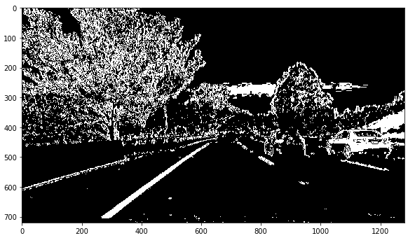

## Udacity – Advanced Lane Finding Project

Submitted by: Neeraj Gulia

Date: March-08-2018

## Objective

The objective of this project is to find the lane lines of the given video. This project gives us insight on how camera can be used to detect the lane lines and thus help in movement of autonomous vehicle.

**The goals / steps of this project are the following:**

- Compute the camera calibration matrix and distortion coefficients given a set of chessboard images.
- Apply a distortion correction to raw images.
- Use color transforms, gradients, etc., to create a threshold binary image.
- Apply a perspective transform to rectify binary image (&quot;birds-eye view&quot;).
- Detect lane pixels and fit to find the lane boundary.
- Determine the curvature of the lane and vehicle position with respect to center.
- Warp the detected lane boundaries back onto the original image.
- Output visual display of the lane boundaries and numerical estimation of lane curvature and vehicle position.

## Rubric Points

### Camera Calibration

The first step is to calibrate the camera. We all know that the camera lens has some distortion, so using camera calibration we can remove the distortion of the images taken by a camera.

With the given camera calibration images, I first found the object points, (x, y, z) coordinates of the chessboard corners in the world. Thus, objp is just a replicated array of coordinates, and objpoints will be appended with a copy of it every time. I successfully detect all but three chessboard corners in the calibration images. imgpoints will be appended with the (x, y) pixel position of each of the corners in the image plane with each successful chessboard detection.

I then used the output objpoints and imgpoints to compute the camera calibration and distortion coefficients using the cv2.calibrateCamera() function. I applied this distortion correction to the test image using the cv2.undistort() function and obtained this result:

Method: **get\_objpoints\_imagepoints**

Figure 1 Original Image

Figure 2 Undistorted Image

## Pipeline (single images)

### Undistorted image

Example of distortion-corrected image

Figure 3 Raw Image

Figure 4 Image after distortion correction

### Thresholded binary image

A combination of color and gradient thresholds is used to generate a binary image.

**convert2binary** function is responsible for converting the image to binary. It takes the undistorted image and outputs the binary image.

Following thresholds were used for all images:

| Name                            | Threshold Value | Kernel size |
|---------------------------------|-----------------|-------------|
| Saturation (HSL) | 90, 255 |   |
| Lightness (HSL) | 190, 255 |   |
| Cr (YCbCr) | 145, 180 |   |
| Sobel x – on grayscaled image | 20, 100 | 7 |
| Magnitude - on grayscaled image | 30, 100 | 9 |
| Directional - on grayscaled image | 0.7, 1.3 | 15 |

Figure 5 Binary image

### Perspective transform

**get\_warped\_image** function is responsible for perspective transforming the binary image. It uses OpenCV&#39;s warpPerspective method to warp the given image

I used following way to find the source and destination points for the perspective transformation.

This resulted into following points:

**Destination** :                        **Source** :

[[576, 453.6]                [[410, 0]

 [704, 453.6]                [870, 0]

 [128, 720.0]                [410, 720]

 [1152, 720.0]]                [870, 720]]

Figure 6 Image after perspective transformation

####  Region of Interest:

The warped image had some noise in the form of road side lines. I further used Region of Interest to mask out those unwanted clutter.

Used following way to find the ROI:

Which converted into following points:

[[400   0]

 [960   0]

 [960 720]

 [400 720]]

Figure 7 image with ROI

### Detection of Lane Lines

I used the convolution method to identify the lane lines. This method divided the image into 9 regions and then by using the numpy&#39;s convolve method it determines the pixels which are hot and are candidate of lane lines. This is done for both the left and right half.

There are few frames where there is a dotted line. In some cases, this method is not able to detect the hot pixels. Hence I have used mean of previous left and right pixels and using that instead. Same logic is applied in case the algorithm identifies some wrong pixels because of some random noise in the image.

If the deviation from the mean is too much (twice of the window width), add only a part of the deviation. This helps in staying on course.

Method **find\_lanes** is responsible for identifying the hot pixels and separating the left and right x points.

Figure 8 Image with lane lines detected

### Finding the polynomial, vehicle position and radius curvature

The points identified for lane lines are passed to the method **draw\_polyfit,** which finds the 2nd degree polynomial and then draws the line on the warped image. Using same polynomial, the bottom leftx and rightx values are obtained which are then compared with the center of the video to identify the deviation of car from the center of the lane lines.

Using this polynomial, the radius curvature is also found in method: **cal\_values.**

The radius and vehicle position are calculated in meters by using the ratio of pixel with meters for x and y axis:

#### Define conversions in x and y from pixels space to meters

 ym\_per\_pix = 30/720 # meters per pixel in y dimension

 xm\_per\_pix = 3.7/700 # meters per pixel in x dimension

After all this the image is warped back to the frames

Figure 9 Final image after all processing

## Pipeline (Video)

The pipeline worked pretty good on the given video.

Output video name is: [Output video](https://github.com/neerajgulia/CarND-Advanced-Lane-Lines/blob/master/output_project_video.mp4)

### Discussions

The pipeline ran too slow on my normal laptop. This is because of resource hungry image processing and lack of GPU on my laptop.

Further I tried the same pipeline on the challenge video but it failed. I know some tweaks can be used to further make the pipeline robust. Overall this project gave me a very good knowledge on how the lane lines can be identified using some advanced method.

## Problem faced:

I tried the convolve method to find the lane lines which was pretty challenging because in case of dashed lines, it failed measurably and deviated.

To rectify this, I used a mean of the left and right center points and put a logic in place if the deviation is too much, add only a fraction of the deviation instead of blindly going with the deviation.

Also, there were few frames where the lane lines were not detected in the threshold binary image and this method failed there as well.

The same mean technique I applied here as well, thus resulted into better prediction.

Cell 5, method name: **find\_window\_centroids**

To smooth the frames transaction, I used an average of line coefficients to plot the lines.